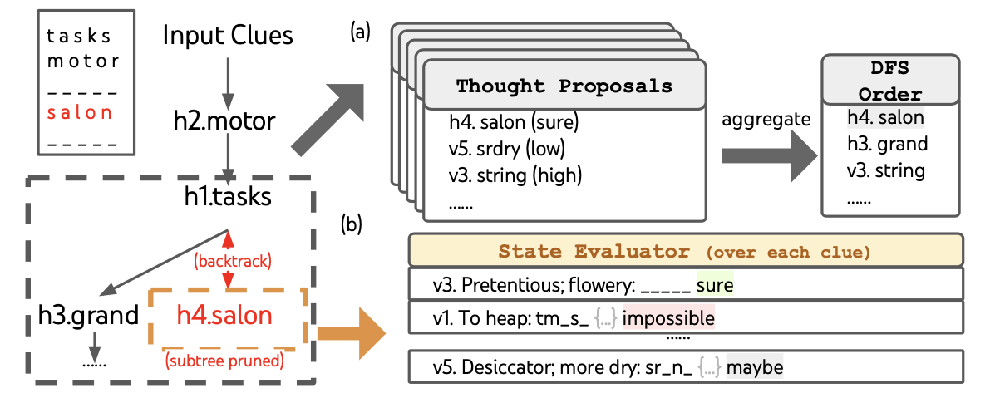

# TreeOfThoughts-Revisited
Considering the impact of Yao et al (2023) "Tree of Thoughts: Deliberate Problem Solving with Large Language Models"

## An Overview of "Tree of Thoughts: Deliberate Problem Solving with Large Language Models"

Paper by Shunyu Yao(1), Dian Yu(2), Jeffrey Zhao(2), Izhak Shafran(2), Thomas L. Griffiths(1), Yuan Cao(2), Karthik Narasimhan(1)

(1) Princeton University, (2) Google DeepMind

[Link to the Tree of Thoughts paper](https://arxiv.org/abs/2305.10601)

[Link to their Github](https://github.com/princeton-nlp/tree-of-thought-llm)

# Table of Contents

- [Key Contributions](#key-contributions)
- [Paper Overview](#paper-overview)
- [Evaluation](#evaluation)
- [Architecture Overview](#architecture-overview)
- [Critical Analysis](#critical-analysis)
- [Impact](#impact)
- [Future Developments](#future-developments)
- [Citation](#citation)
- [Resource Links](#resource-links)

# Key Contributions
The authors introduce Tree of Thoughts (ToT), a framework that fundamentally changes how we approach complex reasoning with language models. Unlike previous methods that follow linear paths, ToT enables models to explore multiple reasoning branches simultaneously, evaluate their progress, and backtrack when needed - much like human problem-solving processes. This approach significantly enhances language models' ability to tackle complex tasks that require strategic planning or where initial decisions are crucial.

***Can transformers think like humans?***

Tree of Thoughts (ToT) enhances LLM reasoning by introducing three key innovations. First, it enables exploring multiple reasoning paths simultaneously through a tree structure. Second, it implements self-evaluation of intermediate thoughts. Third, it allows backtracking when a path proves unproductive. These capabilities make ToT a significant advance over Chain-of-Thought prompting, which follows a single linear path.


# Paper Overview

ToT models reasoning as a search problem through a tree of thoughts. Each thought represents a coherent language sequence serving as an intermediate step toward problem-solving. The framework provides systematic ways to generate new thoughts, evaluate their promise, and explore different reasoning paths. This structure mirrors human problem-solving processes, where we often explore multiple approaches and backtrack from dead ends.


# Evaluation

## Tasks
ToT was evaluated on three challenging tasks that require different types of reasoning:

* **Game of 24:** Players must use four numbers and basic arithmetic operations (+, -, *, /) to create an expression equaling 24. This tests mathematical reasoning and requires exploring different operation sequences.
  

  
* **Creative Writing:** Given random ending sentences, generate a coherent multi-paragraph passage. This tests language generation with long-term planning and consistency constraints.
  


* **Mini Crosswords:** Complete a 5x5 crossword puzzle given the clues. This tests constraint satisfaction and lexical knowledge.
  


## Implementation
Each task uses different ToT configurations:

* Game of 24 uses BFS with depth=3 and beam width b=5, allowing exploration of different operation sequences.
* Creative Writing uses BFS with depth=2, sampling k=5 thoughts at each step.
* Crosswords uses DFS with pruning when a state is deemed impossible.

## Results
Performance comparison across methods:

* **Game of 24:** ToT (74%) vs CoT (4%)
* **Creative Writing:** ToT (7.56/10) vs CoT (6.93/10)
* **Crosswords:** ToT (60%) vs CoT (15.6%)

The authors also analyze computational costs, showing ToT requires more compute than CoT but less than ensemble methods like CoT-Self-Consistency. Cost analysis reveals ToT uses approximately 5.5k completion tokens per problem for Game of 24, comparable to running 100 independent CoT trials.


Error analysis shows ToT's advantages come from avoiding early mistakes through its exploration capability. For example, in Game of 24, about 60% of CoT attempts fail after the first operation, while ToT can explore multiple initial operations.


# Architecture Overview

There are four key components in the ToT architecture:
* Thought Decomposition (Breaking problems into manageable pieces)
* Thought Generation (Exploring multiple possibilities)
* State Evaluation (Judging progress)
* Search Algorithm (Navigating the solution space)


**Pseudocode for Tree of Thoughts [based on Phuong and Hutter (2022) Formal Algorithms for Transformers]**
```
Algorithm TreeOfThoughts(x, p_theta, G, k, V, T, b, SearchType)
Input: Problem input x, language model p_theta, thought generator G, number of thoughts k,
       state evaluator V, max depth T, breadth limit b, search strategy SearchType.
Output: Best solution generated by the model.

1: // Step 1: Thought Decomposition
2: ThoughtSteps ← DecomposeProblem(x)  // Break down x into intermediate steps
3: // Initialize the search
4: S0 ← {InitialState(x)}  // Set the initial state based on the input x

5: // Step 4: Search Strategy Loop
6: for t = 1 to T do
7:     // Step 2: Thought Generation
8:     S_prime ← { [s, z] | s ∈ S_{t-1}, z ∈ G(p_theta, s, k) }  // Generate k thoughts from each state

9:     // Step 3: State Evaluation
10:    if EvaluationType = "Value" then
11:        Vt ← { V(p_theta, s) | s ∈ S_prime }  // Assign a heuristic value to each state
12:    else if EvaluationType = "Vote" then
13:        Vt ← { VoteForBestState(p_theta, S_prime) }  // Vote for the most promising state
14:    end if

15:    // Select top states based on the Search Strategy
16:    if SearchType = "BFS" then
17:        St ← argmax_{S ⊆ S_prime, |S| = b} ∑_{s ∈ S} Vt(s)  // Breadth-First Search: Keep top b states
18:    else if SearchType = "DFS" then
19:        St ← DepthFirstSearch(S_prime, t, p_theta, G, k, V, T, v_threshold)  // Explore deeper paths
20:    end if
21: end for

22: return BestSolution(St)  // Return the best evaluated solution from the final states


// Thought Decomposition Function
Function DecomposeProblem(x)
Input: Problem input x
Output: ThoughtSteps, a list of intermediate steps to solve x

1: // Define the way the problem is broken down into manageable thought steps
2: return ThoughtSteps

// Thought Generation Function
Function GenerateThoughts(p_theta, s, k)
Input: Language model p_theta, current state s, number of thoughts k
Output: k generated thoughts

1: // Use the language model to propose k possible next thoughts
2: return {G(p_theta, s, k)}

// State Evaluation Functions
Function VoteForBestState(p_theta, S_prime)
Input: Language model p_theta, collection of states S_prime
Output: The most promising state based on a voting mechanism

1: // Use the language model to compare states and vote for the best one
2: return VotedState

// Auxiliary function for Depth-First Search
Algorithm DepthFirstSearch(S_prime, t, p_theta, G, k, V, T, v_threshold)
Input: Current states S_prime, step t, language model p_theta, thought generator G, number of thoughts k,
       state evaluator V, max depth T, value threshold v_threshold.
Output: Best solution found or backtrack if needed.

1: if t > T then
2:     return RecordOutput(G(p_theta, S_prime, 1))  // Output the current state solution
3: else
4:     for s in Sorted(G(p_theta, S_prime, k)) do  // Generate and sort k thoughts
5:         if V(p_theta, {s})(s) > v_threshold then  // Prune if below threshold
6:             DepthFirstSearch({s}, t + 1, p_theta, G, k, V, T, v_threshold)  // Recursive DFS
7:         end if
8:     end for
9: end if
```

There are two classical search algorithms that ToT chooses from: Breadth-First-Search (BFS) and Depth-First-Search (DFS)


# Critical Analysis

ToT shows clear strengths in complex problem-solving and reasoning tasks. It achieved 74% accuracy in Game of 24 compared to 4% for CoT, and similar improvements in creative writing and crossword tasks. However, it requires significantly more computation than simpler methods. The framework also depends heavily on effective thought generation and evaluation strategies, which must be designed and hard-coded for each task type.

# Impact

Several major developments in LLM reasoning frameworks have descended from Tree of Thoughts. Graph of Thoughts extended the tree structure to arbitrary graphs, enabling more complex thought relationships. Buffer of Thoughts introduced a meta-buffer to store and reuse reasoning strategies across similar problems. SELF-DISCOVER built on ToT's evaluation mechanism to help models compose their own reasoning structures. These advances show ToT's influence in pushing LLMs toward more sophisticated reasoning capabilities.

# Future Developments

# Citation

Yao, Shunyu, Dian Yu, Jeffrey Zhao, Izhak Shafran, Tom Griffiths, Yuan Cao, and Karthik Narasimhan. (2023). Tree of thoughts: Deliberate problem solving with large language models. arXiv preprint arXiv:2305.10601v2 [Paper](https://arxiv.org/abs/2305.10601)  [GitHub](https://github.com/princeton-nlp/tree-of-thought-llm)

# Resource Links

[Graph of Thoughts: Solving Elaborate Problems with Large Language Models](https://arxiv.org/abs/2308.09687)

[Buffer of Thoughts: Thought-Augmented Reasoning with Large Language Models](https://arxiv.org/abs/2406.04271)
